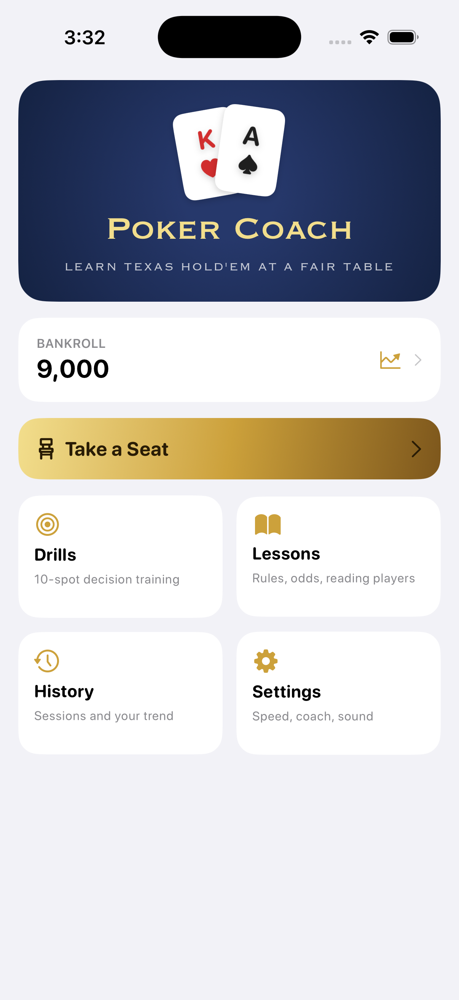
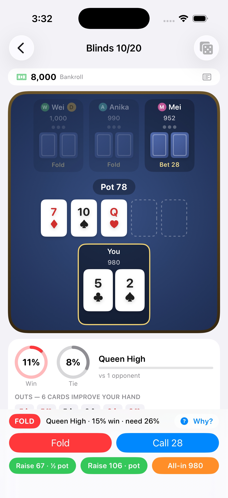
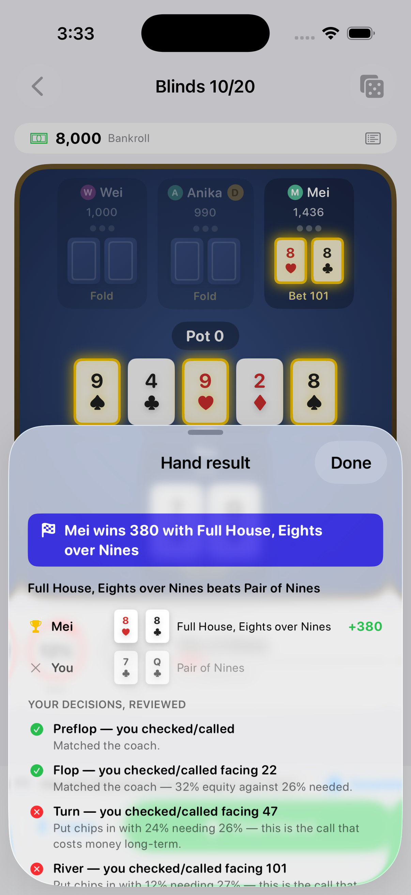

# PokerCoach

[](https://github.com/MURD0X/PokerCoach/actions/workflows/ci.yml)


A native SwiftUI app that teaches Texas Hold'em by playing it. You sit at a
fair table against opponents who each have a hidden personality, while a live
coach shows your real win probability, your outs, and the pot odds on every
decision — and explains, in plain English, what to do and why. After each
hand it grades the decisions you actually made.

The app is a complete learning loop: **learn** in interactive lessons,
**practice** in drills, **play** at coached cash tables and sit-n-go
tournaments, and **review** every hand and your bankroll over time.

| Home | Coaching mid-hand | Post-hand review |
|---|---|---|
|  |  |  |

## Features

### The coach
- **Live equity** — win % and tie % recomputed every street by Monte Carlo
  simulation off the main thread, weighted by what opponents' actions reveal
  about their range (a tight player's raise drops your number, as it should).
- **The full picture** — your made hand and strength, the exact out cards that
  improve you, pot odds vs. your equity, and the rule of 4 and 2.
- **A clear recommendation** — FOLD / CHECK / CALL / BET / RAISE with the
  reasoning written out: Chen-formula scoring preflop (adjusted for your
  position), equity vs. pot odds postflop.
- **Coach modes** — full advice, numbers only (you make the call), or off.
- **Post-hand review** — every decision graded as matched / defensible / a
  leak, on the numbers that were knowable at the time, with the costliest
  mistake called out as the lesson of the hand.

### Learn by doing
- **Interactive lessons** — a table of contents of nine topics with embedded,
  engine-powered widgets: a Chen-scale calculator, a pot-odds playground, a
  "which hand wins?" trainer, and a position explorer. "Learn more" links jump
  from any coaching moment straight to the relevant lesson.
- **Drill mode** — ten rapid-fire decision flashcards per run, scored against
  the coach by the same standards as live play.

### A real table
- **Opponents with personality** — each rolled on three hidden axes
  (tight/loose, passive/aggressive, rookie/expert) that genuinely drive their
  play. You uncover their style by observing, tap a seat to read what you've
  learned, and a new player with a fresh personality takes any busted seat.
- **Bankroll & stakes** — a persistent bankroll, three table stakes with
  bankroll-aware buy-ins, buy-backs, cash-out-and-leave, and a
  bankroll-over-time history.
- **Tournaments** — single-table sit-n-go: escalating blinds, eliminations,
  and a top-two prize pool.
- **Feel** — synthesized card and chip sounds, a hero-turn haptic, and chip /
  deal animations (all respect the silent switch and Reduce Motion).

### Under the hood
- **Provably fair dealing** — every hand shuffles a fresh 52-card deck with
  Fisher–Yates driven by `SystemRandomNumberGenerator` (the OS CSPRNG), so all
  52! deck orders are equally likely. Opponents and the coach see only public
  information — never your opponents' cards.
- **Real no-limit rules** — blinds, burn cards, min-raise enforcement, all-ins
  with correct side pots, split pots, and correct heads-up blind posting.

## Project structure

```
PokerCoach/
├── App/                      # SwiftUI app target (no game logic)
│   ├── PokerCoachApp.swift   # Entry point
│   ├── ContentView.swift     # Root navigation: home + table screen
│   ├── GameViewModel.swift   # Engine ↔ UI bridge, async stats, bankroll
│   ├── Theme.swift           # Dark-premium palette (navy + gold)
│   ├── SoundManager.swift    # Sound effects and haptics
│   ├── SessionHistory.swift  # Persisted session records
│   └── Views/                # Home, table, dashboard, lessons, drills,
│                             #   history, settings, bust/leave/ruin sheets
├── PokerEngine/              # Pure-logic Swift package (no UI dependencies)
│   ├── Sources/PokerEngine/
│   │   ├── Card.swift          # Cards, deck, CSPRNG shuffle
│   │   ├── HandEvaluator.swift # 5/6/7-card evaluation, hand naming
│   │   ├── Equity.swift        # Range-aware Monte Carlo win/tie estimation
│   │   ├── Outs.swift          # Outs detection (hole-card-aware)
│   │   ├── Chen.swift          # Preflop scoring + step breakdown
│   │   ├── Personality.swift   # Three-axis opponents, random lineups
│   │   ├── Coach.swift         # Advice, position, lesson-topic tags
│   │   ├── Reviewer.swift      # Post-hand decision grading
│   │   ├── Tournament.swift    # Sit-n-go schedule and payouts
│   │   ├── HandResult.swift    # Structured showdown results
│   │   └── GameEngine.swift    # Betting rounds, AI, side pots, eliminations
│   └── Tests/PokerEngineTests/ # 72 unit + game-flow tests
├── docs/                     # Architecture, releasing, App Store materials
├── scripts/                  # Export options for TestFlight
└── project.yml               # XcodeGen project definition
```

See [docs/ARCHITECTURE.md](docs/ARCHITECTURE.md) for design details and
[CONTRIBUTING.md](CONTRIBUTING.md) for the development workflow.

## Getting started

### Requirements

- macOS with Xcode 26+ (the iOS 26 SDK is required for App Store / TestFlight
  builds; the simulator and tests run on Xcode 16+)
- [XcodeGen](https://github.com/yonaskolb/XcodeGen) (`brew install xcodegen`) —
  needed only if you change `project.yml`

### Build & run

```sh
git clone https://github.com/MURD0X/PokerCoach.git
cd PokerCoach
xcodegen generate        # regenerates PokerCoach.xcodeproj from project.yml
open PokerCoach.xcodeproj
```

Select an iPhone simulator and press ⌘R.

### Run the tests

```sh
cd PokerEngine
swift test
```

The 72-test suite covers hand evaluation for every category (including the
A-2-3-4-5 wheel and kicker tiebreaks), Chen scores and breakdowns against
known values, range-aware Monte Carlo equity against published probabilities,
outs correctness, side-pot construction, position-aware advice, post-hand
grading, the personality / reveal system, table-snapshot persistence, the
tournament schedule and payouts, seat roles for 2–4 players, and full
simulated hands (cash and a tournament to completion) asserting chip
conservation.

### Debug launch arguments

| Argument | Effect |
|---|---|
| `-autodeal` | Seats the hero and deals the first hand on launch |
| `-autopilot` | Hero auto-plays (check/call) after a pause — UI verification |
| `-autosheets` | Auto-opens the hand-result recap at hand end |
| `-showlog` | Opens the hand-log sheet on launch |
| `-showsettings` | Opens the settings sheet on launch |
| `-showbust` | Opens the out-of-chips sheet with sample stats |
| `-showruin` | Opens the bankroll-gone sheet |
| `-showpicker` | Opens the table picker sheet |
| `-demohistory` | Seeds sample sessions and opens bankroll history |
| `-demoleave` | Leaves the current table, showing the cash-out recap |
| `-showdrills` | Opens drill mode on launch |
| `-showdials` | Opens an opponent's dials popover |
| `-tournament` | Starts a sit-n-go on launch (UI verification) |
| `-tournamentresult` | Opens the sit-n-go standings sheet with sample results |
| `-lessonTopic <id>` | Opens lessons at a topic, e.g. `-lessonTopic chen` |

## Engineering

Every change ships through a pull request with test results in the body; CI
(engine `swift test` + a simulator build) must be green before a squash-merge.
Releases follow [Semantic Versioning](https://semver.org/) with a
[Keep a Changelog](https://keepachangelog.com/) [CHANGELOG](CHANGELOG.md) and
tagged GitHub Releases. See [CONTRIBUTING.md](CONTRIBUTING.md).

## Distribution

The app targets TestFlight and the App Store. Bundle identifier
`com.mpcollins.pokercoach`. Release and upload steps are in
[docs/RELEASING.md](docs/RELEASING.md); App Store listing copy, the privacy
policy, and a submission checklist are in [docs/appstore/](docs/appstore/).

## License

Proprietary. All rights reserved.
