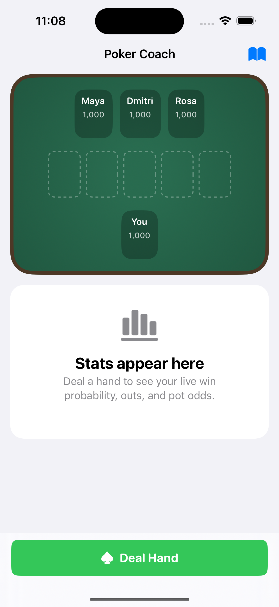
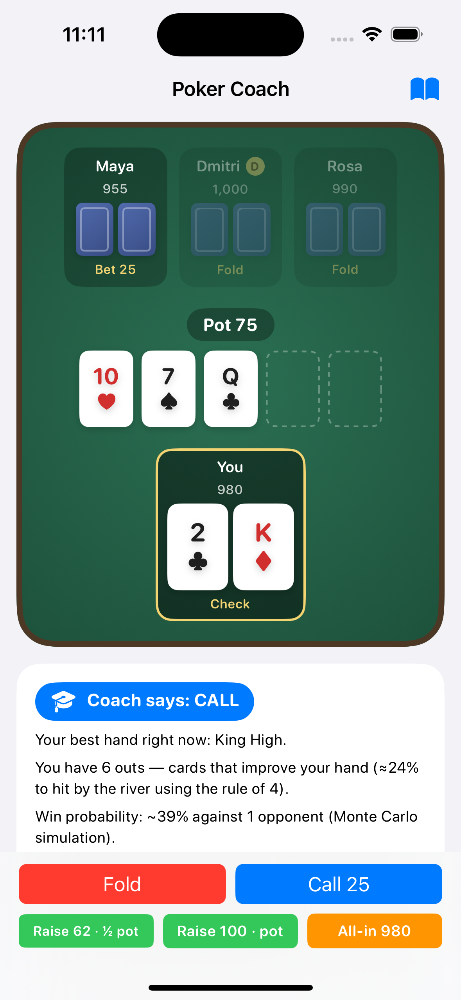
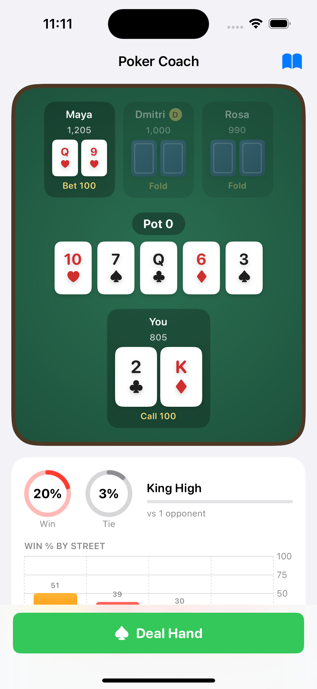

# PokerCoach

[](https://github.com/MURD0X/PokerCoach/actions/workflows/ci.yml)


A native SwiftUI app that teaches Texas Hold'em by playing it. You sit at a
4-handed no-limit table against AI opponents while a live coach shows your win
probability, outs, and pot odds — and explains, in plain English, what to do
and why.

| Idle | Coaching mid-hand | Showdown |
|---|---|---|
|  |  |  |

## Features

- **Live stats dashboard** — win % and tie % gauges recomputed every street
  (Monte Carlo, 2,500 trials off the main thread), your current made hand with
  a strength meter, the exact out cards that improve you, pot odds vs. your
  equity, and a chart of how your win % evolved from preflop to river.
- **Coach** — recommends FOLD / CHECK / CALL / BET / RAISE on every decision,
  with the reasoning written out: Chen-formula scoring preflop, equity vs. pot
  odds postflop, and the rule of 4 and 2 for draws.
- **Provably fair dealing** — every hand shuffles a fresh 52-card deck with
  Fisher–Yates driven by `SystemRandomNumberGenerator` (the OS CSPRNG), so all
  52! deck orders are equally likely. AI opponents see only their own cards
  and the board.
- **Real no-limit rules** — blinds, burn cards, min-raise enforcement, all-ins
  with correct side pots, and split pots.
- **Built-in lessons** — hand rankings, position, pot odds & equity, and an
  explanation of the app's fairness guarantees.

## Project structure

```
PokerCoach/
├── App/                     # SwiftUI app target
│   ├── PokerCoachApp.swift  # Entry point
│   ├── ContentView.swift    # Top-level layout
│   ├── GameViewModel.swift  # Engine ↔ UI bridge, async stats pipeline
│   └── Views/               # Table, cards, dashboard, controls, lessons
├── PokerEngine/             # Pure-logic Swift package (no UI dependencies)
│   ├── Sources/PokerEngine/
│   │   ├── Card.swift         # Cards, deck, CSPRNG shuffle
│   │   ├── HandEvaluator.swift# 5/6/7-card evaluation, hand naming
│   │   ├── Equity.swift       # Monte Carlo win/tie estimation
│   │   ├── Outs.swift         # Outs detection (hole-card-aware)
│   │   ├── Chen.swift         # Preflop starting-hand scoring
│   │   ├── Coach.swift        # Advice generation
│   │   └── GameEngine.swift   # Betting rounds, AI opponents, side pots
│   └── Tests/PokerEngineTests # Unit + game-flow tests
├── project.yml              # XcodeGen project definition
└── docs/                    # Architecture and process documentation
```

See [docs/ARCHITECTURE.md](docs/ARCHITECTURE.md) for design details and
[CONTRIBUTING.md](CONTRIBUTING.md) for the development workflow.

## Getting started

### Requirements

- macOS with Xcode 16+
- [XcodeGen](https://github.com/yonaskolb/XcodeGen) (`brew install xcodegen`) —
  only needed if you change `project.yml`

### Build & run

```sh
git clone https://github.com/MURD0X/PokerCoach.git
cd PokerCoach
xcodegen generate        # regenerates PokerCoach.xcodeproj from project.yml
open PokerCoach.xcodeproj
```

Select an iPhone simulator and press ⌘R.

### Run the tests

```sh
cd PokerEngine
swift test
```

The suite covers hand evaluation for every category (including the A-2-3-4-5
wheel and kicker tiebreaks), Chen scores against known values, Monte Carlo
equity against published probabilities, outs correctness, side-pot
construction, and 25 end-to-end simulated hands asserting chip conservation.

### Debug launch arguments

| Argument | Effect |
|---|---|
| `-autodeal` | Deals the first hand automatically on launch |
| `-autopilot` | Hero auto-plays (check/call) after a 3 s pause — used for UI verification |
| `-autosheets` | Auto-opens the hand-result recap sheet at hand end (UI verification) |
| `-showlog` | Opens the hand-log sheet on launch (UI verification) |
| `-showsettings` | Opens the settings sheet on launch (UI verification) |

## Distribution

The app targets TestFlight distribution. The bundle identifier is
`com.mpcollins.pokercoach`; archive via Product → Archive in Xcode with your
Apple Developer team selected. See [docs/RELEASING.md](docs/RELEASING.md).

## License

Proprietary. All rights reserved.
